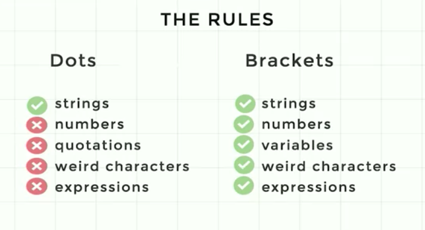

# Objects

## Property Access

```
var person = {
    name: "Mrs. White"
}

person.name // returns "Mrs. White"
```

Anything that uses a "dot" in JS is an object (calling function, getting properties etc)

## Assignment

```
var person = {
    name: "Mrs. White"
}

var who = person.name
person.name = "Mr. White"

console.log(who) // returns "Mrs. White"
console.log(person.name) // returns "Mr. White"
```

Assignment by variable always assign by the value, not by the reference

## Arrays

Arrays are objects with the `length` property

Adding additional properties on array will break its type
E.g

```
var a = []
a.name = "Mrs. White"

console.log(a.name) // returns array
typeof a === "array" // returns false
```

## Bracket []

We use the [] when we can't use the . basically

```
a[0] = "Mrs. White"

```

The 0 basically coerce into a string. However we can't use a.0 because 0 is not a string.


