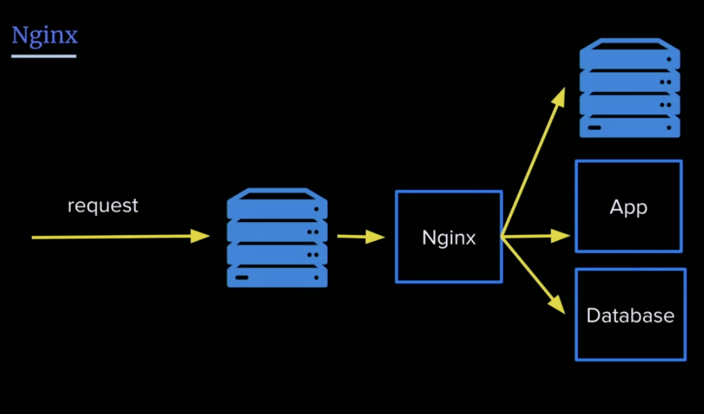

# Nginx

What does it do?

- Reverse proxy
- Web server
- Proxy Server

## What does a webserver do?

Request hit your server. Now what?

That's why Nginx is there. It helps you direct your requests to the right places



```
sudo apt install nginx // install nginx

sudo service nginx start // start nginx
```

## Configuration

- Default config is at `/etc/nginx/sites-available/default`
- Root directory for requests is at `/var/www/html`
- Nginx directives: Macro for doing stuff

## Commands

- To start Nginx: `sudo service nginx start`
- Restart: `sudo service nginx reload`
- Stop: `sudo service nginx stop`

## Redirect

```nginx
# e.g
location /help {
	return 301 https://google.com/;
}
```

Trivia:

- `301` : Permanent redirect
- `302`: Temporary redirect

> To a user they seem to work the same way, but they aren’t the same as far as search engines are concerned. Search engines sense the different types of redirects, and handle them differently. A 301 redirect means that the page has permanently moved to a new location. A 302 redirect means that the move is only temporary. Search engines need to figure out whether to keep the old page, or replace it with the one found at the new location. If the wrong type of redirect has been set up, search engines may become confused, resulting in a loss of traffic.

More info [here](https://www.hochmanconsultants.com/301-vs-302-redirect/#:~:text=A%20301%20redirect%20means%20that,found%20at%20the%20new%20location.)
