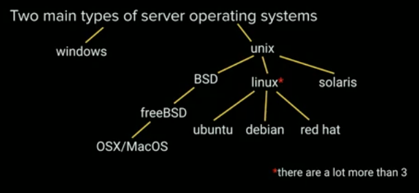

# Server

Serves content. Response to requests

Any computer can be a server. As long as it response to requests and serving content, it is a server

Any port below 1024 is reserved

Servers that we pay for are built differently from our consumer machines. They are custom built machines for serving files. They live in data centers. Run in really cold environment. Usually v clean. Very tight security

Cloud. Allow the same app to be running across the world. Makes things faster. Elastic computing. Allows scaling as needed. Can adjust cost according to traffic

Server can be split into multiple parts for people to share. Each part dont communicate with each other

VPS: Virtual Private Server (e.g DigitalOcean)

An Image is a copy of a base OS

## Operating System

2 main types of server operating systems:

1. Windows
2. Unix-based



Ubuntu is one of the most popular flavour of Linux

Kernel: layer that talks to the machine hardware
Utilities: Tiny applications that do 1 thing. They can be updated and not break the kernel

LTS (Long Term Support) Version: Stable version

## SSH Key

2 ways of going into a server: Password and SSH Key

SSH: Secure Socket Shell. Basically a vvvv large key as of now unbreakable.

Made of 2 parts: Public key and Private key.

- Private key is stored in your computer
- Public key is stored on the server

Everything is encrypted with the public key. Encrypts using private key

To generate a pair of public-private key use `ssh-keygen`

To go in your server, use `ssh root@ip`. If you have more than 1 private key, you need to use `ssh -i yourKeyName root@ip`. If you want to see what is happening use `ssh root@ip -v`.

## Setting up

1. Update software -> security
2. Create a non root user
3. Make that user a superuser
4. Enable login for new user
5. Disable root login

```
apt update // get the list of the most updated version but DOES NOT install

apt upgrade // install from the list of most updated version

adduser $username // adds user in server

usermod -aG sudo $username // add user into superuser group. Otherwise user cant use sudo, and is limited to home page

su $usernam // switch user

sudo cat /var/log/auth.log // check auth log

tail -f $logfile // watch the last 5 log in the log file and keep that command open to keep check for updates

cd ~ // change to home directory

mkdir -p name // make a directory if it doesnt already exist

ls -a // show all directories including hidden

chmod options permissions filename // change permission of a file

chown -R $USER:$USER folder // make a particular folder belong to a particular user so you dont have to sudo everytime
```

[Octal permission list](https://www.computerhope.com/unix/uchmod.htm)

Permission also comes in [owner][group][others]

To disable root login `sudo vi /etc/ssh/sshd_config`
